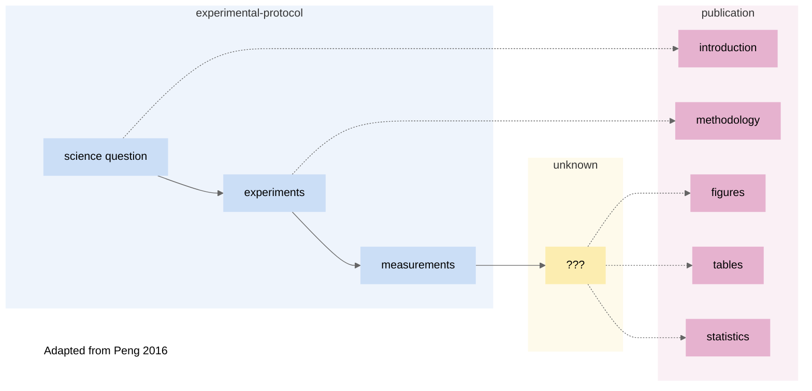
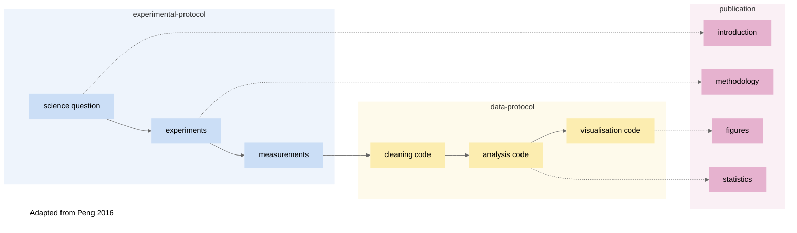
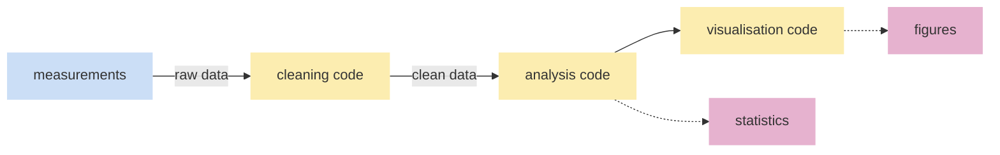

```mermaid
%%{init: {'theme': 'neutral' } }%%
graph LR
subgraph experimental-protocol
A[science question] --> B[experiments]
B --> C[measurements]
end
subgraph unknown
D[???] 
end
C -->  D
subgraph publication
H[introduction]
I[methodology]
D -.-> E[figures]
D -.-> F[tables]
D -.-> G[statistics]
end
A -.-> H
B -.-> I
J[Adapted from Peng 2016]


style A fill:#cbdef6,stroke:#333,stroke-width:0px
style B fill:#cbdef6,stroke:#333,stroke-width:0px
style C fill:#cbdef6,stroke:#333,stroke-width:0px
style D fill:#fcedb0,stroke-width:0px
style E fill:#e6b2cf,stroke:#333,stroke-width:0px
style F fill:#e6b2cf,stroke:#333,stroke-width:0px
style G fill:#e6b2cf,stroke:#333,stroke-width:0px
style H fill:#e6b2cf,stroke:#333,stroke-width:0px
style I fill:#e6b2cf,stroke:#333,stroke-width:0px
style J fill:#fff,stroke:#333,stroke-width:0px
style publication fill:#faf0f5,stroke-width:0px
style unknown fill:#fefaeb, stroke-width:0px
style experimental-protocol fill:#eef4fc,stroke-width:0px


```

```mermaid
%%{init: {'theme': 'neutral' } }%%
graph LR
subgraph experimental-protocol
A[science question] --> B[experiments]
B --> C[measurements]
end
subgraph data-protocol
D[cleaning code] --> E[analysis code]
E --> F[visualisation code]
end
C --> D
subgraph publication
G[introduction]
H[methodology]
F -.-> I[figures]
E -.-> K[statistics]
end
A -.-> G
B -.-> H
M[Adapted from Peng 2016]


style A fill:#cbdef6,stroke:#333,stroke-width:0px
style B fill:#cbdef6,stroke:#333,stroke-width:0px
style C fill:#cbdef6,stroke:#333,stroke-width:0px
style D fill:#fcedb0,stroke-width:0px
style E fill:#fcedb0, stroke-width:0px
style F fill:#fcedb0, stroke-width:0px
style G fill:#e6b2cf,stroke:#333,stroke-width:0px
style H fill:#e6b2cf,stroke:#333,stroke-width:0px
style I fill:#e6b2cf,stroke:#333,stroke-width:0px
style K fill:#e6b2cf,stroke:#333,stroke-width:0px
style M fill:#fff,stroke:#333,stroke-width:0px
style publication fill:#faf0f5,stroke-width:0px
style data-protocol fill:#fefaeb, stroke-width:0px
style experimental-protocol fill:#eef4fc,stroke-width:0px

```

```mermaid
%%{init: {'theme': 'default' } }%%
graph LR
A[measurements]--> |raw data|D[cleaning code]
D --> |clean data| E[analysis code]
E --> F[visualisation code]
F -.-> I[figures]
E -.-> K[statistics]

style A fill:#cbdef6,stroke:#333,stroke-width:0px
style D fill:#fcedb0,stroke-width:0px
style E fill:#fcedb0, stroke-width:0px
style F fill:#fcedb0, stroke-width:0px
style I fill:#e6b2cf,stroke:#333,stroke-width:0px
style K fill:#e6b2cf,stroke:#333,stroke-width:0px
```
