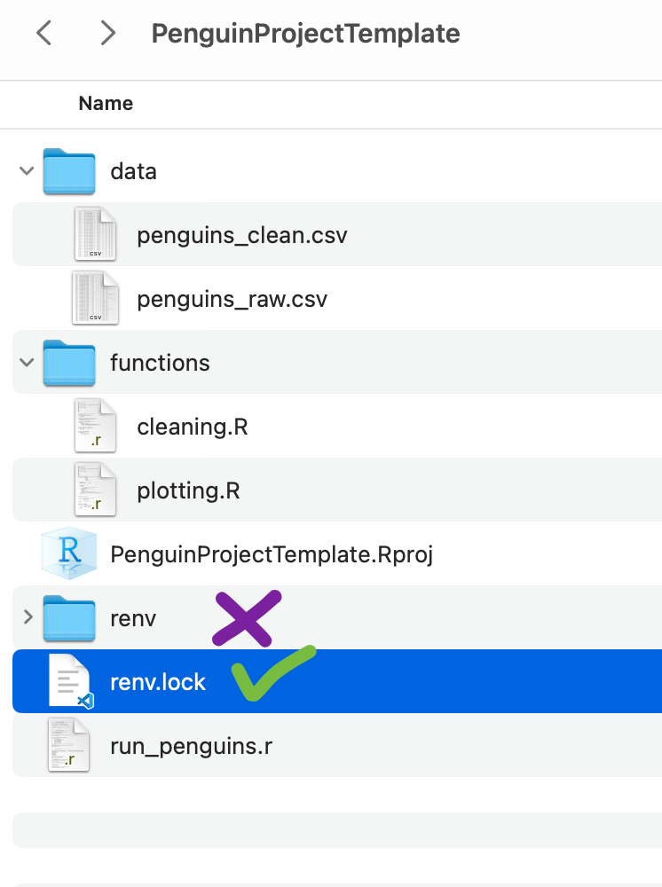
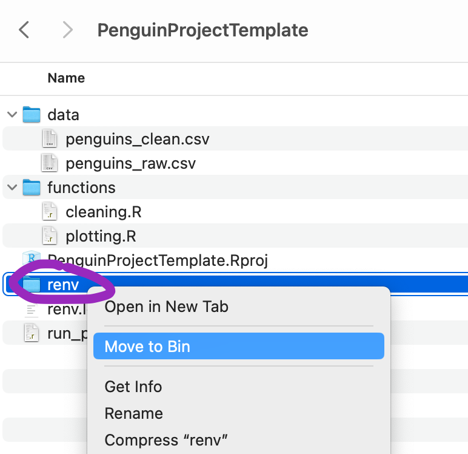

# How to Upload your files and subfolders to GitHub

If you can't get Git to work on your computer, you can upload files manually. Here is what you do:

## Create a new repository

First go to `https://github.com/YourNameHere` and find the `Repository` tab. Then press the green `new` button.  

Provide the name for your Github Repository (this means a folder where you are tracking changes). 

Make sure it is public. 

Then press the `create` button. 

## Add files to the repository

You can then add files by pressing this link in the blue banner. 

### DELETE RENV FOLDER !!! IMPORTANT!!!

You need to delete your `renv` folder from your project. BUT LEAVE THE `renv.lock` file. 

The renv folders stores all your packages so there are tonnes of files inside. We really mustn't upload to GitHub. 

We don't normally need to do this because usually we would ask git to send our files to GitHub and it is smart enough to not send the renv folder. 

With drag and drop we need to do this ourselves.

**BUT** we definitely need the renv.lock file which is how other people know which packages we are using. 

### Drag and drop files

Then you want to navigate to your Project folder in your Windows files or Mac files, open that folder, and drag and drop the contents into the box.

Note: Make sure you don't drag the PenguinProject folder, but instead drag the contents of the folder. 
If you drag the PenguinProject folder itself, it will just end up ugly. 

The files you need to include:
- data folder
- figures folder
- functions folder
- your analysis script
- your .Rproj file
- your renv.lock file

Give it a few seconds to upload. You can see your files have paths that show they are in subfolders. 

Press the green `commit` button when it has finished uploading. 

Now you can see your files and folders in your github repo. If you have a `README.md` this will appear underneath as a sort of welcome page. 

Give your partner the link to the repo. This will be something like  `https//github.com/LydiaFrance/PenguinProject`

Your partner now has to press the green code button, and they can download a zip. This will contain the full subfolder structure, and they just have to unzip it on their machine. 

