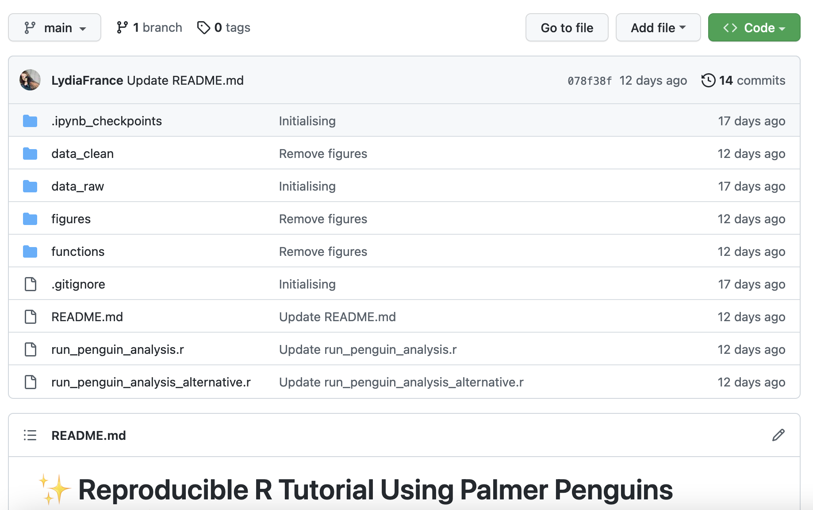

# How to Upload your files and subfolders to GitHub

First go to `https://github.com/YourNameHere` and find the `Repository` tab. Then press the green `new` button.  

Provide the name for your Github Repository (this means a folder where you are tracking changes). 

Make sure it is public. 

Then press the `create` button. 

You can then add files by pressing this link in the blue banner. 

Then you want to navigate to your Project folder in your Windows files or Mac files, open that folder, and drag and drop the contents into the box.

Note: You don't want to drag the PenguinProject folder itself. It will just end up ugly. 

Give it a few seconds to upload. You can see your files have paths that show they are in subfolders. 

Press the green `commit` button when it has finished uploading. 

Now you can see your files and folders in your github repo. If you have a `README.md` this will appear underneath as a sort of welcome page. 

Give your partner the link to the repo. This will be something like  `https//github.com/LydiaFrance/PenguinProject`

Your partner now has to press the green code button, and they can download a zip. This will contain the full subfolder structure, and they just have to unzip it on their machine. 

